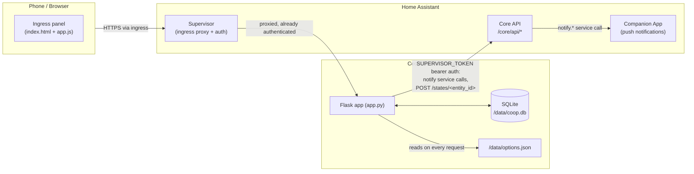

# Coop Tracker — Architecture

This document explains how Coop Tracker is built and, more importantly,
*why* it's built that way. It's meant for anyone (including future-me)
picking this codebase back up after a while. For user-facing behavior see
[DOCS.md](DOCS.md); for what changed release to release see
[CHANGELOG.md](CHANGELOG.md).

## 1. What this is

Coop Tracker is a [Home Assistant add-on](https://developers.home-assistant.io/docs/add-ons):
a small single-purpose web app, packaged as a Docker container, that runs
alongside Home Assistant and is reached through its **ingress** panel (the
sidebar) rather than a directly exposed port. One person, one instance,
logging chicken-coop activity from their phone.

## 2. System context



Everything the add-on does is inside that one container: it never talks to
the internet, and it never accepts connections except through the
Supervisor's ingress proxy.

## 3. Components

| Layer | What | Where |
|---|---|---|
| Frontend | Vanilla HTML/CSS/JS, no framework, no build step | `app/templates/index.html`, `app/static/app.js`, `app/static/style.css` |
| Backend | A single Flask app, one process | `app/app.py` |
| Data | SQLite, one table | `/data/coop.db` (HA-managed persistent volume) |
| Config | HA add-on options, schema-validated by Supervisor | `config.yaml` (schema) → `/data/options.json` (values) |
| Background work | One daemon thread, 60s poll loop | `_background_loop()` in `app.py` |
| Packaging | Multi-arch Docker image, Alpine + Python base | `Dockerfile`, `build.yaml`, `run.sh` |
| Tests | pytest against a real Flask test client + temp SQLite | `app/tests/`, `pytest.ini` (see §16) |

There is deliberately no service layer, no ORM, no separate frontend
build — `app.py` is the whole backend, read top to bottom.

## 4. Data model

Everything (eggs collected, cleaning, feeding, sales, expenses, eggs used)
lives in **one table**:

```sql
CREATE TABLE logs (
    id INTEGER PRIMARY KEY AUTOINCREMENT,
    type TEXT NOT NULL,     -- 'egg' | 'cleaning' | 'feeding' | 'sale' | 'expense' | 'used'
    ts TEXT NOT NULL,       -- ISO 8601, naive local time
    count INTEGER,          -- eggs: collected/sold/used
    food_type TEXT,
    amount TEXT,
    notes TEXT,
    price REAL,             -- sale
    cost REAL,              -- expense
    category TEXT,          -- expense
    container_empty INTEGER,-- feeding: 0/1/NULL, see §10
    given_away INTEGER      -- used: 0/1/NULL, see §11
)
```

`type` is the discriminator; unused columns for a given type are just
`NULL`. New columns are added with `ALTER TABLE ... ADD COLUMN` guarded by
a `PRAGMA table_info` check in `init_db()`, so upgrades (and restores of
older backups) self-migrate with no explicit migration scripts.

**Why one polymorphic table instead of one table per entry type:** the app's
primary view is a unified activity feed (`/api/entries`) and unified
monthly/trend aggregates (`_compute_summary`, `_compute_trends`) — both
want to query "all activity" or "one type across time" without joins.
Six tables would mean six near-identical CRUD paths for a data volume
(a handful of rows a day) where normalization buys nothing.

There are three further tables, none of which belong in `logs` and none
of which break the "one table" reasoning above — none of them are logged
activity, they're reference/roster data the relevant UI reads from and
writes to, categorically different from an entry type:

- `food_types` (id, name), added in v1.16.0 — see §10.
- `breeds` (id, name, annual_eggs), added in v1.18.0 — see §9.
- `chickens` (id, name, breed, hatch_date, status, photo), added in
  v1.18.0 (`photo` in v1.20.0) — see §9. `breed` is a plain `TEXT` column
  matched against `breeds.name` (not a foreign key), the same
  denormalized-by-string pattern as `logs.food_type` against
  `food_types.name` — deleting a breed doesn't cascade or corrupt a
  chicken's record, it just means that name no longer resolves to a rate
  (§9 explains the consequence). `photo` is a nullable `BLOB` — the raw
  image bytes live in the same SQLite file as everything else, so a
  chicken's photo is included in Backup & Restore (§12) for free, with no
  separate file-storage path to back up or restore in step.

## 5. Home Assistant integration

Two independent integration points, both authenticated the same way:

- `SUPERVISOR_TOKEN` (injected by Supervisor as an env var) as a bearer
  token against `http://supervisor/core/api`.
- Requires only the `homeassistant_api: true` permission in `config.yaml`
  — the narrower Core API scope, not full Supervisor management access
  (`hassio_api`).

All of it goes through `_ha_api_request()`, the one function that knows
how to call Home Assistant; it fails soft (returns `(None, error)`)
everywhere instead of raising, since notification/sensor delivery should
never break a user's ability to log an egg.

### 5a. Push notifications (`send_notification`)

`POST /core/api/services/notify/<service>` — the standard HA REST call for
triggering any `notify.*` service, e.g. the Companion App on a phone.

### 5b. Sensors (`_push_ha_sensors`)

`POST /core/api/states/<entity_id>` — sets an entity's state directly, no
integration required on the HA side.

**Why this instead of MQTT discovery** (the more common way add-ons expose
entities): MQTT discovery needs an MQTT broker add-on installed and
configured, which is a real barrier for a small personal add-on. The
direct-states approach needed zero new infrastructure and zero new
permissions — it reuses the exact `homeassistant_api` grant and
`_ha_api_request()` plumbing already in place for notifications.

**The tradeoff, and why it's accepted:** entities created this way aren't
backed by a real integration/config entry, so they don't survive a Home
Assistant *core* restart on their own — HA drops orphan states on restart.
This is mitigated by the existing 60-second background loop (`_push_ha_sensors`
runs every tick regardless of whether anything changed) plus a push after
every write (`api_log`, `api_update_entry`, `api_delete_entry`, via
`_push_ha_sensors_async` — see §6), so entities reappear within a minute
of both services being back up. This is documented as a known caveat in
DOCS.md rather than solved with a real integration, which would mean a
second codebase (a HACS/core integration) for a feature that's genuinely
optional and low-stakes.

## 6. Background work

One daemon thread (`_background_loop`, started from `if __name__ ==
"__main__"`), one loop, 60-second `time.sleep`:

1. `_reminder_tick` — once/day, past the configured check time, sends a
   push notification if eggs are overdue.
2. `_push_ha_sensors` — every tick, refreshes all HA entities (see §5b).

Both share a single `_db_connect_standalone()` SQLite connection per
iteration; both are wrapped in a blanket `except Exception` so one
iteration's failure (e.g. Home Assistant briefly unreachable) can't kill
the loop.

**Why one thread instead of, say, APScheduler or a cron-like library:** at
a 60-second cadence with two cheap checks, a dependency for scheduling
would be pure overhead. The whole loop is ~15 lines.

**The reminder's "already notified today" guard is persisted** (v1.23.0)
in a tiny `app_state` key-value table (`_get_app_state`/`_set_app_state`),
lazily loaded into the module-level `_reminder_last_checked_date` global on
the first tick after startup. The global remains the fast path — the DB is
only read once per process and only written when the guard date advances —
so a restart shortly after today's reminder fired no longer sends a
duplicate. Why a KV table rather than options.json: the app treats
options.json as read-only Supervisor-owned input (§8) and never writes it;
runtime state belongs in the same SQLite file as everything else, where
Backup & Restore (§12) covers it for free.

**Why sensors are also pushed from request handlers** (`api_log`,
`api_update_entry`, `api_delete_entry`) **in addition to the background
loop:** so the Home Assistant dashboard reflects a newly logged entry in
under a second instead of up to 60.

**Why that push runs in its own thread (`_push_ha_sensors_async`,
`threading.Thread(target=_push_ha_sensors_async, daemon=True).start()`)
instead of inline in the request:** `_push_ha_sensors` makes up to 9
sequential HTTP calls to Home Assistant, each with its own 5-second
timeout — if Home Assistant/Supervisor were ever slow or briefly
unreachable, an inline call could make a simple "log an egg" request hang
for up to ~45 seconds before it even responded (fixed in v1.13.1, after
exactly this was reported as entries silently not saving). Since a
`sqlite3` connection can't be shared across threads, the spawned thread
opens its own via `_db_connect_standalone()` rather than reusing the
request's — the same connection-per-thread pattern `_background_loop`
already uses. The trade *for* this fire-and-forget approach: a push
failure inside that thread has nowhere to report back to — but that's
already true of the 60-second background loop's push, and is consistent
with `_ha_api_request`'s existing fail-soft design (§5) where sensor/
notification delivery should never be allowed to break the thing the user
actually came to do.

## 7. Frontend architecture

Single HTML page, two "pages" (`#page-home`, `#page-trends`) toggled via
the `hidden` attribute by a small bottom tab bar — no router, no
history/URL changes, because it's an embedded ingress iframe, not a
standalone site people navigate to directly.

**Why no framework/bundler:** the entire UI is ~200 lines of HTML, ~500
lines of JS. A build step would add a toolchain (npm, bundler config, a
`dist/` the Dockerfile has to know about) for no functional gain at this
size, and would slow down "edit `app.js`, refresh the ingress panel" to
"edit, rebuild, refresh."

**Why `static/app.js` and `static/style.css` are loaded with a
`?v={{ app_version }}` query string (v1.16.0):** without a build step
there's no bundler-generated content hash to bust the cache with either,
and browsers (and mobile webviews especially) cache static JS/CSS
aggressively by default. Without something forcing the URL to change,
updating the add-on updates the server but not necessarily what the
client is actually running — someone could update and restart the
add-on, see the Supervisor confirm success, and still be looking at the
previous version's UI until they happen to hard-refresh (reported and
fixed in v1.16.0). `index()` passes the already-existing `APP_VERSION`
through to the template (`app.py:index`), so every version bump — which
already happens on every release, see §15 — automatically forces a fresh
fetch of both files, with no separate cache-busting mechanism to
maintain.

**Why the Trends chart is hand-rolled inline SVG instead of a charting
library** (Chart.js, etc.): pulling in a chart library either means an
external CDN `<script>` tag — a dependency the ingress panel shouldn't have
on internet access — or vendoring + bundling it, which reopens the "no
build step" decision above. A handful of series, at most ~15 data points
each (12 months of history + 3 forecast), is comfortably within what
`buildTrendsSvg()` can draw directly as `<polyline>`/`<circle>`/`<text>`
elements, styled with the same CSS custom properties (`--accent-egg`,
`--accent-sale`, `--accent-used`) already used for the action buttons, so
it stays visually consistent for free and themes correctly in light/dark
mode. It's a line chart (one `<polyline>` + point `<circle>`s per series)
rather than bars — clearer for reading a trend over many points, and it's
what makes overlaying the continuous forecast/backtest line (§9) read
naturally as one line the actual data either matches or diverges from,
instead of a second set of bars competing for the same x-position.

**Why colors/icons are a shared vocabulary across the app:** `--accent-egg`
/ `--accent-sale` / `--accent-used` are defined once in `style.css` and
reused for the quick-action buttons *and* the Trends legend/bars — a
new chart series reads as "the same thing" as its quick-add button
without extra explanation.

**Why the chart's "expand to full screen" is a CSS class toggle
(`.is-fullscreen` on the existing `#trends-chart-wrap`, `position: fixed;
inset: 0`) instead of the browser's real Fullscreen API
(`element.requestFullscreen()`):** the page runs inside Home Assistant's
ingress `<iframe>`, which this add-on doesn't control the `allow`
attribute of — the Fullscreen API silently fails in an iframe that wasn't
given `allow="fullscreen"`. A same-page fixed-position overlay works
regardless, is the same pattern already used for the log-entry/backup/
notify sheets (just full-bleed instead of a bottom sheet), and — since
it's the identical SVG, not a re-rendered copy — automatically reflows
wider if the user rotates their phone to landscape while it's open,
which is the main practical win over the compact view's fixed 480px-max
container.

**Why every write (`sheetForm`'s submit handler, the history delete
button, restore) checks `res.ok` and wraps its `fetch()` in try/catch
(v1.13.1):** `fetch()` only rejects on a network-level failure (DNS,
connection refused) — it resolves normally for HTTP error statuses, and
for anything that terminates the request before it reaches Flask at all
(an ingress-proxy timeout, the add-on mid-restart), the response the
browser sees usually isn't even the JSON the code expected. The original
code did neither check, so any of those cases would silently fall through
to `closeSheet(); loadSummary(); loadHistory();` exactly as if the save
had succeeded — the entry was never written, but nothing told the user
that. Now a failed write shows an alert and, critically, leaves the sheet
open with the user's input intact instead of discarding it, so retrying
doesn't mean re-typing everything.

**Why My Flock (v1.18.0) is a fourth topbar icon + sheet** rather than
folded into an existing one: it's two related but distinct management
lists (chickens, breeds) with enough fields (a chicken has four) that it
warrants its own space, the same way Backup & Restore and Notifications
already each get their own icon rather than being crammed into one
"settings" sheet. Internally it reuses patterns already established
elsewhere rather than inventing new ones: the breed list is
add/delete-only, styled and wired exactly like the food-type manager
(§10) it was modeled on, and the chicken form's breed `<select>` uses the
very same `ensureFoodTypeOption`-style "preserve a value that's no longer
a valid option" logic to survive a deleted breed without corrupting which
breed a chicken is recorded as.

**Why the HA connection status dot (v1.19.0) is a new tiny element**
instead of extending something existing: `/api/debug` already computed
`ha_api_reachable` for the Notifications panel's collapsed Debug info
section (added v1.7.0) — that data just wasn't visible without opening a
sheet and expanding a toggle first. Rather than duplicate that data
fetch/display logic in a new component, the dot's own click handler
calls `notifyOpenBtn.click()` and then forces the debug section open,
reusing the exact same panel as the detail view instead of building a
second one. It checks once on page load, not on a timer/poll — consistent with the
rest of the app's "fetch when the relevant view is opened" approach
(Home's stats, the Trends tab) rather than a background-refreshed health
check that would need its own interval to manage.

## 8. Config & options

Add-on configuration flows one direction: `config.yaml`'s `schema` defines
what the Supervisor's Configuration tab renders and validates; the values
end up in `/data/options.json`. The app never writes that file, only reads
it, and reads it **fresh on every access** (`_read_options()` opens and
parses it each call — no in-memory cache). There's no dedicated config
object initialized at startup.

**Why read-on-every-access instead of caching at startup:** at this
request volume (one user, occasional taps) re-parsing a small JSON file
is free, and it avoids a whole class of "I changed the config but it
didn't take" bugs that a cache would need explicit invalidation to avoid.
DOCS.md still tells users to restart after a config change, as a
conservative default — not because the code requires it.

## 9. Egg collection forecast

The Trends tab projects 3 months of expected egg collection
(`_forecast_daily_rate`, `_compute_forecast`), shown as a dashed line
continuing past the actual history. It's a blend of two inputs:

1. A **flock baseline** (`_flock_baseline_daily_rate`) — see below for
   where this comes from.
2. The **actual daily rate** over the trailing 30 days, once at least one
   egg has ever been logged.

`forecast_daily_rate = baseline × (actual ÷ baseline)`, with the ratio
clamped to `[0.2, 1.8]` so one unusually good or bad week can't swing the
forecast wildly. Each future month's projection is just that rate × the
number of days in that month.

### Where the baseline comes from

`_flock_baseline_daily_rate(conn, now)` returns `(basis, daily_rate)`:

- **`"individual"`** — if at least one chicken with `status = 'active'`
  exists in the `chickens` table (v1.18.0), the baseline is the sum of
  each one's own age-adjusted rate (`_chicken_daily_rate`): its breed's
  `annual_eggs` (looked up in `breeds` by name) ÷ 365, multiplied by a
  simple age-based stage multiplier (below).
- **`"flat_counts"`** — otherwise, the original v1.9.0-era calculation:
  `flock_isabrown_count` / `flock_sussex_count` × that breed's
  `annual_eggs` ÷ 365, looked up in `breeds` by name ("Isabrown" /
  "Sussex") rather than a hardcoded dict, so editing a breed's
  `annual_eggs` in My Flock affects this fallback path too, not just the
  individual-chicken path.

Both `_compute_forecast` and `_compute_backtest` (via `_forecast_daily_rate`)
expose which basis is active as `forecast_flock_basis`, surfaced in the
Trends tab caption so it's never a silent switch.

**Why individual chickens *replace* the flat counts instead of both being
combined:** the two are different levels of fidelity for the same
question ("how many eggs should this flock produce today") — averaging a
precise per-bird answer with a coarse flat-count answer would just make
the precise one worse. Falling back to flat counts only when zero active
chickens exist means existing installs (from before v1.18.0) keep working
unchanged, and newly added chickens take over immediately, with no
"which mode am I in" setting to manage.

**The age curve (`_age_stage_multiplier`)** is deliberately one simple
3-stage shape shared by every breed — not laying below
`POINT_OF_LAY_DAYS` (~20 weeks), full rate through `PRIME_END_DAYS`
(~18 months), `REDUCED_RATE_MULTIPLIER` (0.8×) after — applied to
whichever breed's own `annual_eggs` a bird has. A more realistic model
would vary this curve per breed (a production hybrid like Isabrown peaks
sharper and declines faster than a heritage dual-purpose breed like
Sussex) and decline further year over year rather than stopping at one
reduced rate — deliberately not built: it's a lot more surface area to
get right and explain for a personal add-on, and the per-breed
`annual_eggs` figure already captures most of the difference between
breeds that actually matters for a flat forecast. A chicken with no
`hatch_date` is assumed to be in its prime (multiplier 1.0) — the most
forgiving default, rather than 0 (which would silently zero out a real
laying hen just because its exact hatch date isn't known) or a mid-range
guess that's no more justified than "assume it's productive."

**Why deleting a breed doesn't error or silently reassign affected
chickens:** `_get_breed_annual_eggs` returns `None` for a name with no
match in `breeds`, and `_chicken_daily_rate` treats that as a 0 rate —
the chicken record itself, including its `breed` string, is untouched.
This mirrors `logs.food_type` surviving a food type's removal (§10): the
`breed` column was never a foreign key, so there's nothing to cascade,
and the fix (reassign the bird, or re-add the breed) is always available
without any data having been lost in the meantime.

**Why a blend instead of pure breed-standard or pure historical trend:**
pure breed-standard math is accurate on day one (no history needed) but
never reflects how a specific flock actually performs (age, molting, a
lost hen). Pure historical extrapolation reflects reality but is noisy
or meaningless with little data — a brand-new install has nothing to
extrapolate from. The blend gets a sensible number immediately and leans
on real data as it accumulates, without needing a threshold like "wait 30
days before showing anything."

**Why this "self-corrects" without a stored model:** there's no training
step, no persisted forecast state. `_forecast_daily_rate` is a pure
function of `(conn, now)` — it's recomputed from scratch every time the
Trends tab loads, always looking at "the last 30 days as of right now."
If the flock's actual laying rate changes, the very next computation
already reflects it. This is the same "read fresh, no cache" philosophy
as options.json (§8) applied to a derived value instead of raw config.

### Seasonal adjustment (v1.26.0)

The forecast originally used a flat daily rate; the accepted limitation
was projecting *across* a season boundary (e.g. November into February),
which a flat rate over/under-shoots. v1.26.0 adds the "natural next step"
that earlier text promised: one universal sinusoid over the calendar year
(`_seasonal_multiplier`), peaking at the summer solstice —

```
s(t) = 1 + SEASONAL_AMPLITUDE × cos(2π × (day_of_year(t) − SEASONAL_PEAK_DAY) / 365.25)
```

with `SEASONAL_AMPLITUDE = 0.25` and `SEASONAL_PEAK_DAY = 172` (~Jun 21).
Its annual mean is ≈ 1.0, so a breed's `annual_eggs` total is
*redistributed* across the year, not inflated. Same philosophy as the age
curve: one universal shape, no per-breed seasonal curves.

**Where the factor applies — and why the ratio's denominator gets it
too:** the trailing-30-day actual rate already embeds the current season,
so comparing it against the *flat* baseline would misread a seasonally
normal winter low as a badly performing flock and project that
depression flatly into spring. Instead (`_forecast_components`):

- `ratio = clamp(actual_30d / (baseline_flat × s(now)))` — a
  season-independent flock-health signal ("how are we doing vs. what's
  seasonally expected"), which is what the clamp bounds were always
  meant to dampen.
- projected `rate(month) = baseline_flat × s(month midpoint) × ratio`.

A useful consequence, asserted by a test: evaluated *at* `now` the
seasonal terms cancel (`baseline × s(now) × actual/(baseline × s(now)) =
actual`), so the blended "current" rate still equals the observed
trailing rate exactly as before — seasonality only reshapes the
projection across months. The backtest applies the same treatment
retroactively (data cutoff at a month's start, seasonal factor at its
midpoint), so it remains a fair test of the shipped formula.

**Why amplitude and peak day are constants, not config:** fewest-knobs
philosophy — this add-on has a single known user at ~56°N with an unlit
coop, for which ±25% is a defensible round number. If the backtest shows
it running consistently off, `SEASONAL_AMPLITUDE` is the one knob to
tune. The northern-hemisphere assumption is the new (much smaller)
accepted limitation — see §17.

### Chicken photos (v1.20.0)

A photo is an optional `BLOB` on `chickens`, served at its own route
(`GET /api/chickens/<id>/photo`, returned as `image/jpeg`) rather than
embedded in the `/api/chickens` list response — the list is fetched every
time My Flock opens and is used internally (`_flock_baseline_daily_rate`)
for the forecast, so it stays a `has_photo` boolean there; the actual
bytes are only fetched per-chicken, by an `` tag, and only
for the ones the browser is actually rendering. `_flock_baseline_daily_rate`'s
own `chickens` query explicitly lists the columns it needs (`breed`,
`hatch_date`) rather than `SELECT *`, for the same reason: a backtest
calls it once per historical month, and there's no reason to re-read a
possibly-large photo blob 24 times over just to compute a number that
never uses it.

**Why the image is resized client-side (a `<canvas>` draw to ~400px,
re-encoded as JPEG) instead of a server-side library:** the alternative
is a Python image-processing dependency (e.g. Pillow) added to the Docker
image just for this one feature, in a project that has otherwise stayed
dependency-free (`requirements.txt` is just `flask`, see §7's "no
framework" reasoning) — resizing in the browser before upload achieves
the same "don't let a multi-MB phone photo bloat the database" goal with
no new dependency at all.

**Why setting a chicken's `photo` field follows the same "explicit key
present, falsy value clears it" convention as `container_empty`/other
optional fields (§10):** `"photo" in data` distinguishes "the client
didn't mention photos, leave it alone" from "the client explicitly sent
`null`/empty, clear the existing one" — the same distinction the frontend
needs anyway (`pendingPhotoDataUri` is `undefined` vs `null` vs a real
data URI in `app.js`), so the API mirrors it instead of inventing a
different convention for one field.

### Backtest: how the forecast performed in past months

`_compute_backtest` answers "what would the forecast have said for this
month, back when it started?" for every month `_compute_trends` already
returns, so the user can see forecast accuracy directly against actual
history rather than just trusting the forward projection.

**Why this needed no new forecasting logic:** `_forecast_daily_rate(conn,
now)` already takes `now` as a parameter and only ever looks *backward*
from it (§9). A backtest for month M is just calling that exact same
function with `now` set to month M's start instead of the real current
time — it naturally only sees data that existed before that point,
because that's how the function was already written. `_compute_backtest`
is a ~10-line loop over `_recent_month_starts` (factored out of
`_compute_trends` for this reuse) calling the existing function once per
historical month; there's no separate backtesting engine or simulation
framework.

One consequence worth knowing: the current, still-in-progress month's
backtest/forecast is a *full-month* projection, compared in the UI against
that month's *partial* actual-so-far — they're expected to diverge until
the month ends, that's not a forecast miss.

**Individual chickens back this same way, for free (v1.18.0):**
`_chicken_daily_rate(conn, chicken, now)` computes age as `(now -
hatch_date).days`, so calling it with a past `now` (as the backtest does)
naturally computes the bird's age *as of that past month*, not its
current age — no separate historical-age logic needed, same reuse as the
rest of this section. A consequence worth knowing here too: a chicken's
`hatch_date` is treated as always having been true, even for a roster
entry added to the app today — backtesting a year-old month with a bird
entered only today still uses that bird's real age back then, which is
the intended behavior for a retroactive tool, not a bug. Also: if no
chickens existed yet at some point in your history but you've since added
some, `_flock_baseline_daily_rate` still switches entirely to the
individual-chicken basis for *every* backtested month, including ones
that predate adding any chickens — there's no per-month record of "which
basis was active back then" to preserve, and recomputing history with
better (per-bird) data once you have it is treated as an improvement, not
a bug to guard against.

### Uncertainty band (v1.28.0)

The Trends chart shades a range around the forward-looking forecast line,
answering "how far off has this actually been?" instead of asking the
user to just trust a bare point estimate. `_compute_forecast_margin`
(app.py, next to `_compute_backtest`) is the mean absolute error between
`forecast_backtest` and `collected` over *completed* historical months —
the current, still-in-progress month is excluded for the exact reason
given above (a full-month projection vs. a partial actual isn't a fair
comparison, and including it would make the band jump around based on how
far through the current month it happens to be). `None` with no completed
month to measure yet (a fresh install), so the frontend suppresses the
band entirely rather than draw one from zero data.

**Why MAE, not a standard deviation or RMSE:** it's a single number with a
plain-English reading ("actual collection has typically landed within ±N
eggs of this projection") — the same "one constant, explained in a
sentence" style as the age curve (§9 above) and the seasonal amplitude.
RMSE would let one unusually bad month dominate the figure; MAE treats
every month's miss equally.

**Why the band is flat across all `FORECAST_MONTHS`, not growing with
distance into the future** (the intuitive shape — forecasts usually get
less certain the further out they go): `_compute_backtest` only ever
tests a **1-month-ahead** prediction — data cutoff at a month's start,
predicting that same month. It never tests what a 2- or 3-month-ahead
projection would have looked like, so there's no data in this app
supporting a claim like "month 3 is twice as uncertain as month 1." A
flat margin, applied uniformly, is the only shape the existing backtest
data actually backs — inventing a growth curve on top would be modeling
something with zero supporting evidence, the opposite of this section's
established "simple and honest first" bias.

## 10. Feed duration estimate

A `container_empty` boolean on `logs` (meaningful only for `type =
'feeding'`, `NULL` otherwise — the same "extra nullable column on the one
polymorphic table" pattern as `price`/`cost`/`category`, see §4) marks a
feeding entry as "the container was empty, this is a refill."
`_compute_feeding_stats(conn, food_type, now)` finds every `container_empty
= 1` entry for a given `food_type`, and averages the intervals between
consecutive ones to answer "how long does a container of this actually
last?" — exposed at `/api/feeding-stats?food_type=...`.

**Why `food_type` is a dropdown instead of free text (v1.15.0):**
grouping by `food_type` only works if the same feed is always logged with
the exact same string — free text meant a single typo ("Pellets" vs
"Pellet") silently created a second, separate history. `food_type` in
`logs` itself is still a plain `TEXT` column, unconstrained, matched
`LOWER(TRIM(...))`-normalized in `_compute_feeding_stats` exactly as
before — the dropdown is a frontend behavior, not a schema constraint on
`logs`.

**Why the dropdown's options live in their own `food_types` table
instead of a fixed list in the frontend code (v1.16.0):** the initial cut
hardcoded the options directly in `app.js`, on the reasoning that a
single-flock add-on doesn't need a managed registry — in practice, the
whole point of a strict, no-free-text list is that it has to match what
you actually feed, and a personal list of feeds is exactly the kind of
thing that changes over time (new supplement, stop using a scratch mix).
A separate table with `POST`/`DELETE /api/food-types` (seeded once from
`DEFAULT_FOOD_TYPES` — see `init_db()` — the first time the table is
created, empty afterwards) gets that editability without touching `logs`
or its schema at all.

**Why editing an entry whose food type isn't in the current list doesn't
silently change it** (logged before the dropdown existed, or since
removed via Manage list): a `<select>` has nowhere to put a value that
isn't one of its options — naively building it would leave such an entry
on whatever option happens to be first, and saving would then quietly
overwrite its real value. `ensureFoodTypeOption()` checks for this and,
if the entry's stored value isn't among the fetched options, inserts it
as one extra selected option instead — old data is preserved exactly as
logged rather than corrected or lost. The same function backs the
"pre-fill with what I used last time" case, so a not-yet-standard value
carries forward the same way on a new entry too. This is also why
deleting a food type is safe: it only narrows what's offered for *new*
entries, `logs` rows referencing it are untouched and still display/edit
correctly.

**Why the Manage list panel doesn't jump the current selection to
whatever you just added:** it's opened from within the Log Feeding
sheet, so adding a type while you're really just tidying up the list
shouldn't change what you're about to log — `loadFoodTypeOptions()` is
called with the food type that was already selected, not the new one, so
the add flow only affects the dropdown's contents, never its
current value.

**Why the single-food-type estimate is shown inline in the Log Feeding
sheet** rather than only as a dashboard number: that's where the question
("how's this container doing, is it about time to check on more feed?")
actually comes up — right as you're about to log a feeding.
`updateFeedingStatsHint()` fetches and re-renders it whenever the
food-type dropdown changes, so it stays relevant if you're logging a
different feed than usual in the same session.

**Why an average of historical intervals instead of, say, a countdown
from projected days-remaining:** a countdown would need to know the bag
size and daily consumption rate — data the app doesn't collect (it tracks
*feeding events*, not quantity consumed per feeding in a comparable unit).
The interval between "container was empty" checkboxes is something the
app can compute exactly from data it already has, with no new fields
beyond the one checkbox. Needs at least two "empty" events for the
average to appear at all; with only one there's a "last emptied N days
ago" but no average yet — shown as such rather than a misleadingly
precise number from a single data point.

### Feed refill cadence table (Trends tab, v1.17.0)

`_compute_all_feeding_stats(conn, now)` answers the same question as
`_compute_feeding_stats`, for every food type at once — exposed at
`/api/feeding-stats-all`, rendered as a table on the Trends tab. It's a
thin wrapper: find every distinct `food_type` ever logged, then call the
existing per-food-type function once per name. No new stats logic, just
a fan-out over it.

**Why it's driven by `DISTINCT food_type` from `logs`, not by the
`food_types` management table:** the management list (§10 above) governs
what's *offered* for new entries; this table is a retrospective summary
of what's actually happened. Basing it on the management list would drop
a food type's history the moment it's removed from that list — exactly
the kind of silent data loss `ensureFoodTypeOption()` was built to avoid
elsewhere. Querying `logs` directly means the summary always reflects
everything you've ever logged, regardless of what's still offered going
forward.

**Why it ignores the chart's 3/6/12-month range selector** and is always
all-time: a meaningful "average days between refills" typically needs
more history than even a 3-month window provides — a food type refilled
every 20 days only shows 1-2 refill events in a 3-month window, too few
for the average to mean much. Scoping it to the selector would make the
number flicker between "reasonable" and "not enough data" as someone
casually changes the range for the unrelated egg chart above it.

**Why `total_feedings` (every feeding logged, whether or not the
container was empty) is shown alongside `empty_count`** (only the
"container was empty" ones): a food type fed 40 times with 2 refills
reads very differently from one fed 3 times with 2 refills, even though
both would show the same 1-2 "empty" data points — the total gives cheap
context for how much history backs the average, at the cost of one extra
`COUNT(*)` query already grouped by the same normalized `food_type` match.

## 11. Estimated savings

`_compute_summary` (§4/§9's "unified monthly aggregates" — the same
function behind Revenue/Costs/Net) also returns `savings_month` /
`savings_total`: eggs logged as `used` × `supermarket_egg_price` (a
price per single egg), for the current month and all-time, shown as a
fourth tile next to Revenue/Costs/Net in the Finances section.

**Why only `used` eggs count, not `sold` or total collected:** a sold egg
is already counted once, as revenue — counting it again here as "savings"
would inflate the picture of what the flock is worth without a
corresponding real transaction backing it. An egg logged as `used` never
generates revenue anywhere else in the app, so this is the one place its
value is captured at all; that's a deliberate choice over the simpler
"count every egg collected," which was considered and rejected
specifically for double-counting with sales.

**Why `given_away` eggs are excluded too (v1.22.0):** a `used` entry can
now carry a `given_away` flag (same nullable-INTEGER pattern as feeding's
`container_empty` — `_normalize_bool_flag` handles both). Eggs given away
still leave the coop (they count against `eggs_available` like any other
`used` egg), but they don't reduce anyone's own grocery bill, so they're
filtered out of `savings_month`/`savings_total` specifically
(`AND (given_away IS NULL OR given_away = 0)`) while `eggs_used_total`
feeding `eggs_available` stays unfiltered — the two figures deliberately
diverge once given-away eggs exist.

**Why the price option is per egg, not per dozen (v1.21.1):** v1.21.0
shipped with `supermarket_egg_price_per_dozen` on the reasoning that egg
prices are usually known/quoted per dozen — asked directly, the user
preferred entering a per-egg price and having the app skip that division
step entirely, which is what `supermarket_egg_price` (default `2.5`) now
does. The option was renamed rather than reinterpreting the same key with
new units: silently treating an already-configured dozen-price (e.g. `30`)
as a per-egg price would have been a 12x error with no error message to
catch it — a straight rename means the old key is just quietly unused
instead. Still a plain add-on option like `currency` or the flock counts,
not a new managed table — there's exactly one value to hold.

**Why the result isn't rounded in the backend:** `revenue_month` /
`cost_month` / etc. are also returned as raw floats — rounding for
display already happens once, in the frontend's `fmtMoney()`, which knows
the configured currency's actual decimal convention (e.g. `0` for JPY).
Rounding a second time in the backend, to some arbitrary precision that
may not match, would be redundant at best and silently lossy at worst;
`savings_month`/`savings_total` follow the same convention the adjacent
fields already established rather than inventing a different one.

## 12. Backup & restore

`/api/backup` streams the raw SQLite file back to the browser as a
download; `/api/restore` accepts an uploaded file, validates it has the
expected columns (`_is_valid_backup`), then atomically swaps it in with
`os.replace` and runs `init_db()` again to backfill any columns added
since the backup was taken.

**Why a raw SQLite file instead of a JSON/CSV export format:** it's a
100% fidelity, zero-transformation-code round trip — no export schema to
maintain, no version-to-version export format compatibility to worry
about. The cost (an opaque binary file instead of something a user could
eyeball or edit) is acceptable for a single-user backup feature.

**Why a CSV export coexists with that** (v1.24.0, `/api/export.csv`): the
CSV is for *analysis* — opening the log in a spreadsheet — not backup, and
it's deliberately one-way: there is no CSV import, so none of the
format-compatibility burden that ruled CSV out as the backup format
applies. It mirrors the `logs` table's columns verbatim (`EXPORT_COLUMNS`),
no curation, `NULL` as empty string. Standard comma delimiter, no
Excel-specific `sep=,` hint line — that hint breaks every other CSV parser;
locales whose Excel defaults to semicolons can use its import dialog
(noted in DOCS.md).

## 13. Serving model

Served by **waitress** (v1.25.0; previously Flask's dev server), from the
same `python app.py` entry point: `serve(app, host="0.0.0.0", port=port)`,
where the port defaults to 8099 and can be overridden with `COOP_PORT`
(same env-override pattern as `COOP_DB_PATH`/`COOP_OPTIONS_PATH`; used by
the e2e test fixture to pick a free port). Ingress config is unchanged.

**Why waitress specifically, not gunicorn:** the load-bearing property is
that waitress is a **single-process, threaded** server. A prefork server
with N>1 workers would import the module N times — N copies of
`_background_loop` (duplicate reminders, N× the HA sensor traffic) and N
copies of the `_reminder_last_checked_date` fast-path global. Waitress
preserves the one-process/one-background-thread invariant §6 depends on,
while removing the dev server's "not for production" warning and its
single-threaded request handling. It's also pure Python, so it installs
without compilation on every base image in `build.yaml`. Requests are now
genuinely concurrent across threads, which the DB access patterns already
tolerate: connection-per-request via `flask.g` (§4), connection-per-thread
everywhere else.

## 14. Packaging & init

Multi-arch build (`aarch64`, `amd64`, `armhf`, `armv7`, `i386`) against
Home Assistant's own per-arch Python/Alpine base images (`build.yaml`), so
the add-on matches whatever the Supervisor already ships for that host.

`config.yaml` sets `init: false`. **Why:** the base image already runs
s6-overlay v3 as PID 1; leaving Supervisor's own init wrapper enabled on
top of that caused a startup crash (`s6-overlay-suexec: fatal: can only
run as pid 1`), fixed in v1.1.1. `run.sh` is a `with-contenv` script for
the same s6-overlay reason — it's what makes `SUPERVISOR_TOKEN` and other
Supervisor-injected env vars actually visible to `python3 app.py` (v1.6.1
fix; s6-overlay v3 doesn't pass its environment to a plain script
otherwise).

## 15. Versioning

There's no release automation. Each user-visible change bumps three
things together, by hand:

1. `version` in `config.yaml` (what the Supervisor's add-on store checks
   to offer an update)
2. `APP_VERSION` in `app.py` (surfaced in the in-app debug panel and
   startup log, so a running instance is self-identifying)
3. A new entry at the top of `CHANGELOG.md`

**Why manual instead of e.g. reading `config.yaml` at runtime to derive
`APP_VERSION`:** the container doesn't have a YAML parser dependency, and
`config.yaml` isn't even copied into the image (only `app/` is — see
`Dockerfile`). Keeping a plain string constant avoids adding a dependency
and a build step just to avoid typing the version twice; the comment next
to `APP_VERSION` exists specifically to flag this manual-sync requirement.

## 16. Testing

Backend tests live in `app/tests/`, run with `pytest` from `coop-tracker/`:

```
pip install -r app/requirements-dev.txt
pytest
```

`pytest.ini` (at the repo root of the add-on) puts `app/` on `sys.path` so
tests `import app` directly — the same module the container runs, not a
copy or a reimplementation.

**Approach:** tests go through Flask's `test_client()` against a real
(temporary, per-test) SQLite file — not mocks of the database — since the
SQL itself (`_compute_summary`, `_compute_trends`, the polymorphic `logs`
queries) is most of the app's actual logic. `app.DB_PATH` / `OPTIONS_PATH`
/ `SUPERVISOR_TOKEN` are monkeypatched per test via fixtures in
`conftest.py`, since the app reads all three as module-level globals
rather than through an injectable config object (see §8) — the tests work
with that design rather than restructuring the app to be more
"testable" for its own sake.

HA integration (`_push_ha_sensors`, `send_notification`, `/api/debug`'s
reachability check) is tested against a real local `http.server` instance
standing in for the Supervisor Core API (the `fake_ha_server` fixture),
not a mocking library — it asserts on the actual HTTP paths and JSON
bodies `_ha_api_request` sends, which is what would actually reach Home
Assistant.

**Frontend smoke tests** live in `app/tests_e2e/`, run explicitly:

```
pip install -r app/requirements-e2e.txt
playwright install chromium
pytest app/tests_e2e
```

They use **Playwright for Python** (`pytest-playwright`) — pip-installed,
no Node toolchain, consistent with §7's no-build-step stance (the earlier
objection to frontend testing was the Node dependency, which the Python
bindings remove). A session fixture launches the real entry point
(`python app.py` → waitress, on a free `COOP_PORT`, throwaway DB, no
`SUPERVISOR_TOKEN` so the background loop exits immediately) and drives it
in headless Chromium.

**Deliberately smoke-only** (~5 tests: page loads, log an egg end-to-end,
history renders, Trends chart draws, My Flock opens): behavioral logic is
already covered at the backend layer where it's cheap and fast; the e2e
layer only proves the UI-to-API wiring works in a real browser. Because
`pytest.ini` sets `testpaths = app/tests`, a bare `pytest` stays
backend-only — CI runs the e2e suite as a separate job so the fast suite
stays fast.

## 17. Known limitations (accepted, not oversights)

- **HA sensor entities don't survive a Home Assistant core restart** on
  their own (see §5b) — self-heals within a minute, not instant.
- **Single flock/coop, single currency, single user.** There's no
  multi-tenant or multi-coop model; adding one would mean threading a
  coop/flock ID through the schema, every query, and the UI, which isn't
  justified by the current use case.
- **The forecast's seasonal curve (§9) assumes the northern hemisphere**
  (`SEASONAL_PEAK_DAY` ≈ the June solstice) and one fixed ±25% amplitude.
  A southern-hemisphere install would get the seasons inverted; a lit
  coop would see less seasonal swing than modeled. Both are acceptable
  for a single-known-user add-on; the constants are the tuning point if
  that changes.

## 18. Per-chicken health records (v1.27.0)

A `health_events` table (`chicken_id`, `event_type`, `event_date`,
`weight_grams`, `notes`, `created_at`) surfaced as a "Health history"
section inside the My Flock chicken edit form. Routes: `GET`/`POST`
`/api/chickens/<id>/health`, `DELETE /api/health-events/<id>`.

**Why a separate table, not more rows in `logs`:** a health event belongs
to a *chicken*, not to the flock's activity feed. Stuffing it into the
polymorphic `logs` table would poison every aggregate that scans it
(`_compute_summary`, `_compute_trends`, feeding stats) with rows they'd
all have to know to exclude, and would leave `chicken_id` as yet another
nullable column that only one type uses.

**Why `chicken_id` is a real id reference** — unlike `logs.food_type` and
`chickens.breed`, which are deliberately string-matched (§4): those are
historical records that must survive their referent being renamed or
deleted. A health event without its chicken is meaningless — there's
nothing worth preserving once the bird itself is gone — so this is the
schema's first true parent-child relationship, and chicken deletion
removes its events.

**Why the cascade is manual** (a `DELETE FROM health_events` in
`api_delete_chicken`) even though the column declares `ON DELETE
CASCADE`: SQLite only enforces foreign keys under `PRAGMA foreign_keys =
ON`, which this app has never set on any connection. Turning it on
globally for one feature would be a behavior change on every connection
path (requests, background loop, restore) for zero additional benefit
over one explicit delete; the `REFERENCES` clause stays as schema
documentation.

**Why a fixed `event_type` set** (`HEALTH_EVENT_TYPES`: vet_visit,
vaccination, molt_start, molt_end, weight, observation): the same
free-text-fragments lesson as food types (§10) — and `observation` is the
pressure valve for anything the fixed set doesn't cover, with details in
`notes`. `weight_grams` is required for `weight` events, optional
elsewhere.
