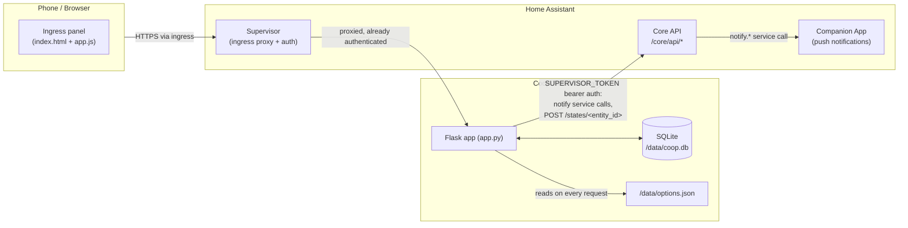

# Coop Tracker — Architecture

This document explains how Coop Tracker is built and, more importantly,
*why* it's built that way. It's meant for anyone (including future-me)
picking this codebase back up after a while. For user-facing behavior see
[DOCS.md](DOCS.md); for what changed release to release see
[CHANGELOG.md](CHANGELOG.md).

## 1. What this is

Coop Tracker is a [Home Assistant add-on](https://developers.home-assistant.io/docs/add-ons):
a small single-purpose web app, packaged as a Docker container, that runs
alongside Home Assistant and is reached through its **ingress** panel (the
sidebar) rather than a directly exposed port. One person, one instance,
logging chicken-coop activity from their phone.

## 2. System context



Everything the add-on does is inside that one container: it never talks to
the internet, and it never accepts connections except through the
Supervisor's ingress proxy.

## 3. Components

| Layer | What | Where |
|---|---|---|
| Frontend | Vanilla HTML/CSS/JS, no framework, no build step | `app/templates/index.html`, `app/static/app.js`, `app/static/style.css` |
| Backend | A single Flask app, one process | `app/app.py` |
| Data | SQLite, one table | `/data/coop.db` (HA-managed persistent volume) |
| Config | HA add-on options, schema-validated by Supervisor | `config.yaml` (schema) → `/data/options.json` (values) |
| Background work | One daemon thread, 60s poll loop | `_background_loop()` in `app.py` |
| Packaging | Multi-arch Docker image, Alpine + Python base | `Dockerfile`, `build.yaml`, `run.sh` |
| Tests | pytest against a real Flask test client + temp SQLite | `app/tests/`, `pytest.ini` (see §13) |

There is deliberately no service layer, no ORM, no separate frontend
build — `app.py` is the whole backend, read top to bottom.

## 4. Data model

Everything (eggs collected, cleaning, feeding, sales, expenses, eggs used)
lives in **one table**:

```sql
CREATE TABLE logs (
    id INTEGER PRIMARY KEY AUTOINCREMENT,
    type TEXT NOT NULL,     -- 'egg' | 'cleaning' | 'feeding' | 'sale' | 'expense' | 'used'
    ts TEXT NOT NULL,       -- ISO 8601, naive local time
    count INTEGER,          -- eggs: collected/sold/used
    food_type TEXT,
    amount TEXT,
    notes TEXT,
    price REAL,             -- sale
    cost REAL,              -- expense
    category TEXT           -- expense
)
```

`type` is the discriminator; unused columns for a given type are just
`NULL`. New columns are added with `ALTER TABLE ... ADD COLUMN` guarded by
a `PRAGMA table_info` check in `init_db()`, so upgrades (and restores of
older backups) self-migrate with no explicit migration scripts.

**Why one polymorphic table instead of one table per entry type:** the app's
primary view is a unified activity feed (`/api/entries`) and unified
monthly/trend aggregates (`_compute_summary`, `_compute_trends`) — both
want to query "all activity" or "one type across time" without joins.
Six tables would mean six near-identical CRUD paths for a data volume
(a handful of rows a day) where normalization buys nothing.

## 5. Home Assistant integration

Two independent integration points, both authenticated the same way:

- `SUPERVISOR_TOKEN` (injected by Supervisor as an env var) as a bearer
  token against `http://supervisor/core/api`.
- Requires only the `homeassistant_api: true` permission in `config.yaml`
  — the narrower Core API scope, not full Supervisor management access
  (`hassio_api`).

All of it goes through `_ha_api_request()`, the one function that knows
how to call Home Assistant; it fails soft (returns `(None, error)`)
everywhere instead of raising, since notification/sensor delivery should
never break a user's ability to log an egg.

### 5a. Push notifications (`send_notification`)

`POST /core/api/services/notify/<service>` — the standard HA REST call for
triggering any `notify.*` service, e.g. the Companion App on a phone.

### 5b. Sensors (`_push_ha_sensors`)

`POST /core/api/states/<entity_id>` — sets an entity's state directly, no
integration required on the HA side.

**Why this instead of MQTT discovery** (the more common way add-ons expose
entities): MQTT discovery needs an MQTT broker add-on installed and
configured, which is a real barrier for a small personal add-on. The
direct-states approach needed zero new infrastructure and zero new
permissions — it reuses the exact `homeassistant_api` grant and
`_ha_api_request()` plumbing already in place for notifications.

**The tradeoff, and why it's accepted:** entities created this way aren't
backed by a real integration/config entry, so they don't survive a Home
Assistant *core* restart on their own — HA drops orphan states on restart.
This is mitigated by the existing 60-second background loop (`_push_ha_sensors`
runs every tick regardless of whether anything changed) plus an immediate
push after every write (`api_log`, `api_update_entry`, `api_delete_entry`),
so entities reappear within a minute of both services being back up. This
is documented as a known caveat in DOCS.md rather than solved with a real
integration, which would mean a second codebase (a HACS/core integration)
for a feature that's genuinely optional and low-stakes.

## 6. Background work

One daemon thread (`_background_loop`, started from `if __name__ ==
"__main__"`), one loop, 60-second `time.sleep`:

1. `_reminder_tick` — once/day, past the configured check time, sends a
   push notification if eggs are overdue.
2. `_push_ha_sensors` — every tick, refreshes all HA entities (see §5b).

Both share a single `_db_connect_standalone()` SQLite connection per
iteration; both are wrapped in a blanket `except Exception` so one
iteration's failure (e.g. Home Assistant briefly unreachable) can't kill
the loop.

**Why one thread instead of, say, APScheduler or a cron-like library:** at
a 60-second cadence with two cheap checks, a dependency for scheduling
would be pure overhead. The whole loop is ~15 lines.

**Why sensors are also pushed synchronously inside request handlers**
(`api_log`, `api_update_entry`, `api_delete_entry`) **in addition to the
background loop:** so the Home Assistant dashboard reflects a newly logged
entry in under a second instead of up to 60. This mirrors the existing
pattern of `send_notification` already being called synchronously from
`/api/notify-test`.

## 7. Frontend architecture

Single HTML page, two "pages" (`#page-home`, `#page-trends`) toggled via
the `hidden` attribute by a small bottom tab bar — no router, no
history/URL changes, because it's an embedded ingress iframe, not a
standalone site people navigate to directly.

**Why no framework/bundler:** the entire UI is ~200 lines of HTML, ~500
lines of JS. A build step would add a toolchain (npm, bundler config, a
`dist/` the Dockerfile has to know about) for no functional gain at this
size, and would slow down "edit `app.js`, refresh the ingress panel" to
"edit, rebuild, refresh."

**Why the Trends chart is hand-rolled inline SVG instead of a charting
library** (Chart.js, etc.): pulling in a chart library either means an
external CDN `<script>` tag — a dependency the ingress panel shouldn't have
on internet access — or vendoring + bundling it, which reopens the "no
build step" decision above. A handful of series, at most ~15 data points
each (12 months of history + 3 forecast), is comfortably within what
`buildTrendsSvg()` can draw directly as `<polyline>`/`<circle>`/`<text>`
elements, styled with the same CSS custom properties (`--accent-egg`,
`--accent-sale`, `--accent-used`) already used for the action buttons, so
it stays visually consistent for free and themes correctly in light/dark
mode. It's a line chart (one `<polyline>` + point `<circle>`s per series)
rather than bars — clearer for reading a trend over many points, and it's
what makes overlaying the continuous forecast/backtest line (§9) read
naturally as one line the actual data either matches or diverges from,
instead of a second set of bars competing for the same x-position.

**Why colors/icons are a shared vocabulary across the app:** `--accent-egg`
/ `--accent-sale` / `--accent-used` are defined once in `style.css` and
reused for the quick-action buttons *and* the Trends legend/bars — a
new chart series reads as "the same thing" as its quick-add button
without extra explanation.

## 8. Config & options

Add-on configuration flows one direction: `config.yaml`'s `schema` defines
what the Supervisor's Configuration tab renders and validates; the values
end up in `/data/options.json`. The app never writes that file, only reads
it, and reads it **fresh on every access** (`_read_options()` opens and
parses it each call — no in-memory cache). There's no dedicated config
object initialized at startup.

**Why read-on-every-access instead of caching at startup:** at this
request volume (one user, occasional taps) re-parsing a small JSON file
is free, and it avoids a whole class of "I changed the config but it
didn't take" bugs that a cache would need explicit invalidation to avoid.
DOCS.md still tells users to restart after a config change, as a
conservative default — not because the code requires it.

## 9. Egg collection forecast

The Trends tab projects 3 months of expected egg collection
(`_forecast_daily_rate`, `_compute_forecast`), shown as a dashed line
continuing past the actual history. It's a blend of two inputs:

1. A **breed-standard baseline**: published average annual eggs/hen for
   the configured flock (`BREED_ANNUAL_EGGS`, `flock_isabrown_count` /
   `flock_sussex_count` options), converted to eggs/day.
2. The **actual daily rate** over the trailing 30 days, once at least one
   egg has ever been logged.

`forecast_daily_rate = baseline × (actual ÷ baseline)`, with the ratio
clamped to `[0.2, 1.8]` so one unusually good or bad week can't swing the
forecast wildly. Each future month's projection is just that rate × the
number of days in that month.

**Why a blend instead of pure breed-standard or pure historical trend:**
pure breed-standard math is accurate on day one (no history needed) but
never reflects how a specific flock actually performs (age, molting, a
lost hen). Pure historical extrapolation reflects reality but is noisy
or meaningless with little data — a brand-new install has nothing to
extrapolate from. The blend gets a sensible number immediately and leans
on real data as it accumulates, without needing a threshold like "wait 30
days before showing anything."

**Why this "self-corrects" without a stored model:** there's no training
step, no persisted forecast state. `_forecast_daily_rate` is a pure
function of `(conn, now)` — it's recomputed from scratch every time the
Trends tab loads, always looking at "the last 30 days as of right now."
If the flock's actual laying rate changes, the very next computation
already reflects it. This is the same "read fresh, no cache" philosophy
as options.json (§8) applied to a derived value instead of raw config.

**Why flat (no seasonal curve) for now:** the actual-rate half of the
blend already reflects current real-world conditions for the *near*
future — a currently-depressed winter rate is already priced in. The gap
is only projecting *across* a season boundary (e.g. forecasting from
November into February), which a flat rate will over/under-shoot. This
was a deliberate choice to ship something simple and honest first (see
DOCS.md's forecast section, which states the limitation directly) rather
than build a month-by-month seasonal adjustment curve — that's the
natural next step if the flat forecast proves noticeably off across a
season boundary.

### Backtest: how the forecast performed in past months

`_compute_backtest` answers "what would the forecast have said for this
month, back when it started?" for every month `_compute_trends` already
returns, so the user can see forecast accuracy directly against actual
history rather than just trusting the forward projection.

**Why this needed no new forecasting logic:** `_forecast_daily_rate(conn,
now)` already takes `now` as a parameter and only ever looks *backward*
from it (§9). A backtest for month M is just calling that exact same
function with `now` set to month M's start instead of the real current
time — it naturally only sees data that existed before that point,
because that's how the function was already written. `_compute_backtest`
is a ~10-line loop over `_recent_month_starts` (factored out of
`_compute_trends` for this reuse) calling the existing function once per
historical month; there's no separate backtesting engine or simulation
framework.

One consequence worth knowing: the current, still-in-progress month's
backtest/forecast is a *full-month* projection, compared in the UI against
that month's *partial* actual-so-far — they're expected to diverge until
the month ends, that's not a forecast miss.

## 10. Backup & restore

`/api/backup` streams the raw SQLite file back to the browser as a
download; `/api/restore` accepts an uploaded file, validates it has the
expected columns (`_is_valid_backup`), then atomically swaps it in with
`os.replace` and runs `init_db()` again to backfill any columns added
since the backup was taken.

**Why a raw SQLite file instead of a JSON/CSV export format:** it's a
100% fidelity, zero-transformation-code round trip — no export schema to
maintain, no version-to-version export format compatibility to worry
about. The cost (an opaque binary file instead of something a user could
eyeball or edit) is acceptable for a single-user backup feature.

## 11. Serving model

Flask's built-in dev server (`app.run(host="0.0.0.0", port=8099)`) *is*
the production server here — there's no gunicorn/uWSGI in front of it.

**Why that's an accepted tradeoff, not an oversight:** the add-on is
single-user, LAN-only, reached exclusively through the Supervisor's
authenticated ingress proxy (never a directly exposed port — there's no
`ports:` mapping in `config.yaml`). The concurrency and hardening a
production WSGI server buys don't apply to that traffic profile.

## 12. Packaging & init

Multi-arch build (`aarch64`, `amd64`, `armhf`, `armv7`, `i386`) against
Home Assistant's own per-arch Python/Alpine base images (`build.yaml`), so
the add-on matches whatever the Supervisor already ships for that host.

`config.yaml` sets `init: false`. **Why:** the base image already runs
s6-overlay v3 as PID 1; leaving Supervisor's own init wrapper enabled on
top of that caused a startup crash (`s6-overlay-suexec: fatal: can only
run as pid 1`), fixed in v1.1.1. `run.sh` is a `with-contenv` script for
the same s6-overlay reason — it's what makes `SUPERVISOR_TOKEN` and other
Supervisor-injected env vars actually visible to `python3 app.py` (v1.6.1
fix; s6-overlay v3 doesn't pass its environment to a plain script
otherwise).

## 13. Versioning

There's no release automation. Each user-visible change bumps three
things together, by hand:

1. `version` in `config.yaml` (what the Supervisor's add-on store checks
   to offer an update)
2. `APP_VERSION` in `app.py` (surfaced in the in-app debug panel and
   startup log, so a running instance is self-identifying)
3. A new entry at the top of `CHANGELOG.md`

**Why manual instead of e.g. reading `config.yaml` at runtime to derive
`APP_VERSION`:** the container doesn't have a YAML parser dependency, and
`config.yaml` isn't even copied into the image (only `app/` is — see
`Dockerfile`). Keeping a plain string constant avoids adding a dependency
and a build step just to avoid typing the version twice; the comment next
to `APP_VERSION` exists specifically to flag this manual-sync requirement.

## 14. Testing

Backend tests live in `app/tests/`, run with `pytest` from `coop-tracker/`:

```
pip install -r app/requirements-dev.txt
pytest
```

`pytest.ini` (at the repo root of the add-on) puts `app/` on `sys.path` so
tests `import app` directly — the same module the container runs, not a
copy or a reimplementation.

**Approach:** tests go through Flask's `test_client()` against a real
(temporary, per-test) SQLite file — not mocks of the database — since the
SQL itself (`_compute_summary`, `_compute_trends`, the polymorphic `logs`
queries) is most of the app's actual logic. `app.DB_PATH` / `OPTIONS_PATH`
/ `SUPERVISOR_TOKEN` are monkeypatched per test via fixtures in
`conftest.py`, since the app reads all three as module-level globals
rather than through an injectable config object (see §8) — the tests work
with that design rather than restructuring the app to be more
"testable" for its own sake.

HA integration (`_push_ha_sensors`, `send_notification`, `/api/debug`'s
reachability check) is tested against a real local `http.server` instance
standing in for the Supervisor Core API (the `fake_ha_server` fixture),
not a mocking library — it asserts on the actual HTTP paths and JSON
bodies `_ha_api_request` sends, which is what would actually reach Home
Assistant.

**Not covered:** the frontend (`app.js`/`style.css`/`index.html`) has no
automated tests. Adding one (e.g. via Playwright) would mean a Node
toolchain purely for testing, in a project that deliberately has none for
the app itself (§7) — UI changes are still verified by hand (a headless-
Chrome pass during development), not by CI. This is the most likely gap
to revisit if the frontend grows past what a manual pass can reliably
cover.

## 15. Known limitations (accepted, not oversights)

- **Reminder's "already notified today" guard is in-memory only**
  (`_reminder_last_checked_date` is a module-level global, not persisted).
  An add-on restart shortly after today's reminder fired could send one
  duplicate. Documented in DOCS.md as a deliberate simplicity tradeoff.
- **HA sensor entities don't survive a Home Assistant core restart** on
  their own (see §5b) — self-heals within a minute, not instant.
- **Single flock/coop, single currency, single user.** There's no
  multi-tenant or multi-coop model; adding one would mean threading a
  coop/flock ID through the schema, every query, and the UI, which isn't
  justified by the current use case.
- **The egg collection forecast (§9) doesn't model seasonality.** A flat
  daily rate projected across a season boundary (e.g. summer → winter)
  will run high or low. Deferred deliberately in favor of shipping a
  simple, honest forecast first — see §9 for the reasoning.
